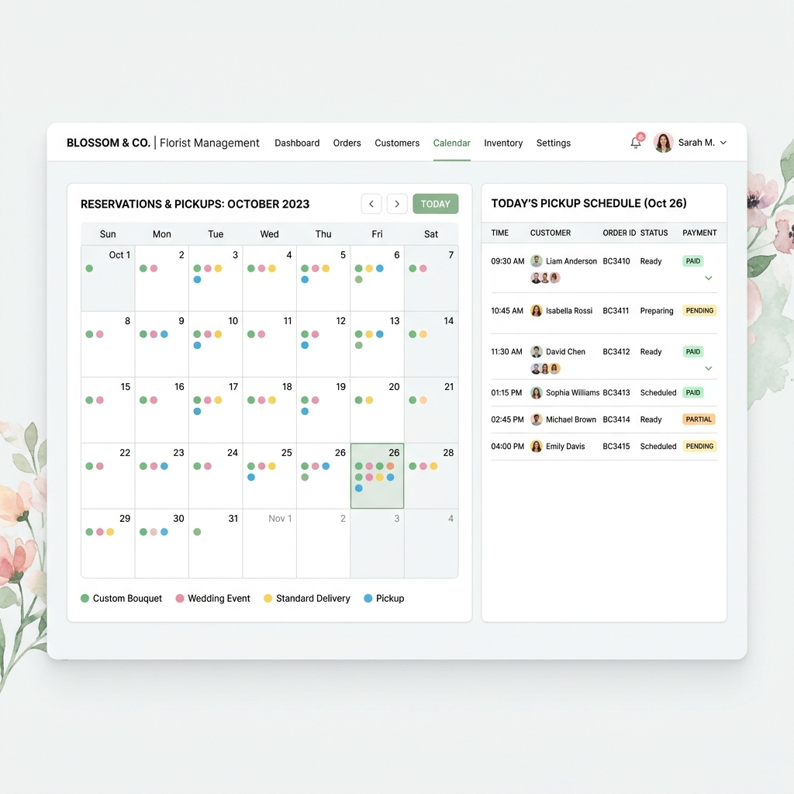
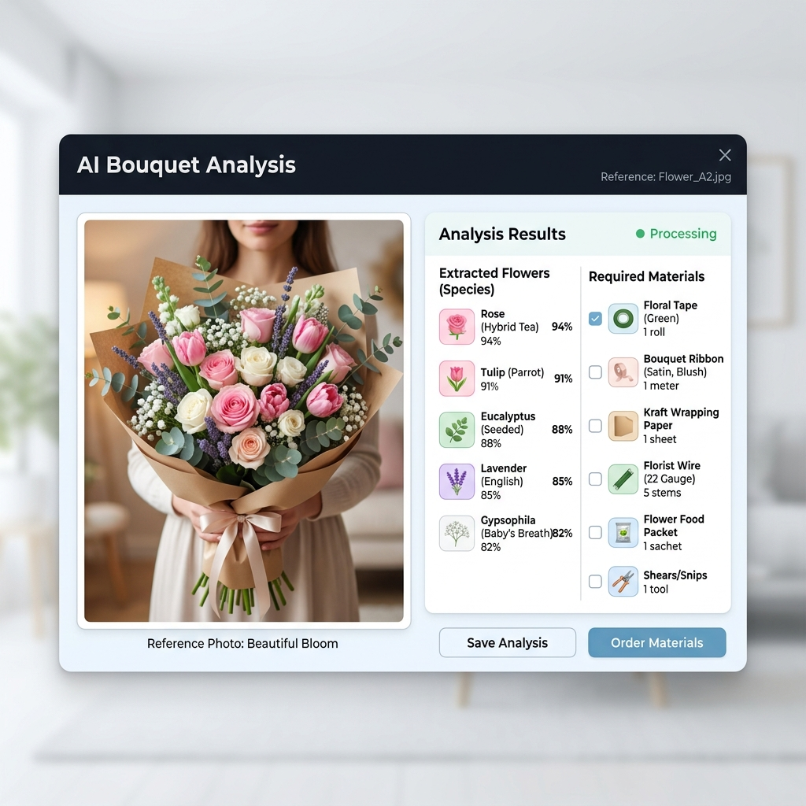
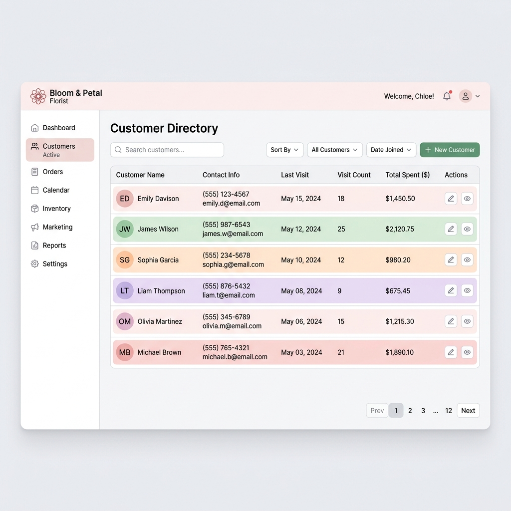

# 🌷 Flower AI Manager

AI 기반 플로리스트 예약 및 고객 관리 시스템입니다. 
복잡한 꽃 예약 내역을 캘린더로 한눈에 관리하고, 고객이 보낸 시안 이미지를 AI가 분석하여 필요한 꽃과 사입 자재를 자동으로 추출해 줍니다.

## 🖼 스크린샷 (Screenshots)

| 캘린더 스케줄링 (Calendar UI) | AI 이미지 분석 (AI Analysis UI) |
| :---: | :---: |
|  |  |

| 고객 CRM 관리 (Customer CRM) |
| :---: |
|  |

## ✨ 주요 기능 (Key Features)
- **📅 캘린더 기반 스케줄링**: 직관적인 달력 UI로 일자별 예약 내역과 픽업 시간을 관리합니다.
- **🤖 AI 시안 이미지 분석**: 예약 시 첨부된 레퍼런스 이미지를 AI가 분석하여 꽃 종류와 사입해야 할 자재 목록을 자동으로 작성합니다.
- **👥 고객 관리 (CRM)**: 고객별 방문 횟수, 결제 금액, 지난 예약 내역을 모아볼 수 있습니다.
- **🔔 실시간 알림**: 새로운 예약이 접수되면 WebSocket을 통해 화면에 실시간 알림 토스트를 띄워줍니다.
- **💳 예약 상태 관리**: 선결제/미결제 상태 및 픽업(대기/완료) 여부를 간편하게 관리합니다.

## 🛠 기술 스택 (Tech Stack)
- **Frontend**: HTML5, CSS3, JavaScript (Vanilla JS)
- **Backend**: Python, FastAPI
- **Database**: SQLite (SQLAlchemy ORM)
- **AI**: OpenAI Vision API 
- **Communication**: REST API, WebSockets

## 🚀 시작하기 (Getting Started)

### 1. 백엔드 (Backend) 실행
```bash
# 1. backend 폴더로 이동
cd backend

# 2. 필요한 패키지 설치
pip install -r requirements.txt

# 3. 환경변수(.env) 설정 (OpenAI API 키 등)
# backend 폴더 안에 .env 파일을 생성하고 아래 내용을 입력하세요.
# OPENAI_API_KEY=your_api_key_here

# 4. FastAPI 서버 실행 (http://localhost:8000)
uvicorn main:app --reload
```
API 명세서(Swagger UI)는 `http://localhost:8000/docs`에서 확인할 수 있습니다.

### 2. 프론트엔드 (Frontend) 실행
별도의 프레임워크 빌드 과정 없이 `frontend` 폴더 내의 `index.html` 파일을 브라우저로 직접 열거나, VSCode의 **Live Server** 확장을 통해 실행할 수 있습니다.
```bash
# Live Server 사용 시 
frontend 폴더에서 index.html 우클릭 -> "Open with Live Server" 클릭
```

## 📁 프로젝트 구조 (Project Structure)
- `/backend`: FastAPI 기반의 API 서버, 데이터베이스 모델(`models.py`), AI 분석 로직(`ai_service.py`), 웹소켓 통신 코드 등
- `/frontend`: 사용자 UI, 컴포넌트(`components/`), 스타일시트(`index.css`) 및 뷰 로직(`pages/home.js`)
