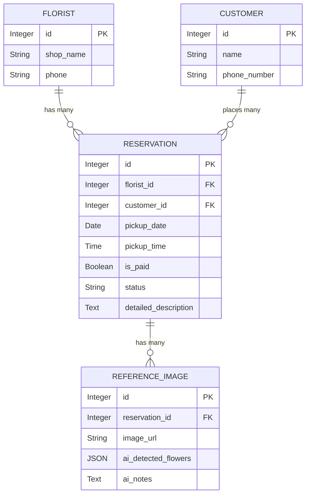

# Backend Entity Relationship Diagram (ERD)

Here is the Entity Relationship Diagram based on the current backend implementation (`models.py`).

```mermaid
erDiagram
    FLORIST ||--o{ RESERVATION : "has many"
    CUSTOMER ||--o{ RESERVATION : "places many"
    RESERVATION ||--o{ REFERENCE_IMAGE : "has many"

    FLORIST {
        Integer id PK
        String shop_name
        String phone
    }

    CUSTOMER {
        Integer id PK
        String name
        String phone_number
    }

    RESERVATION {
        Integer id PK
        Integer florist_id FK
        Integer customer_id FK
        Date pickup_date
        Time pickup_time
        Boolean is_paid
        String status
        Text detailed_description
    }

    REFERENCE_IMAGE {
        Integer id PK
        Integer reservation_id FK
        String image_url
        JSON ai_detected_flowers
        Text ai_notes
    }
```
